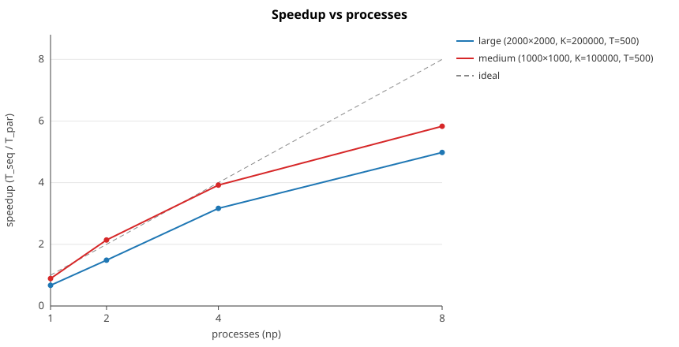
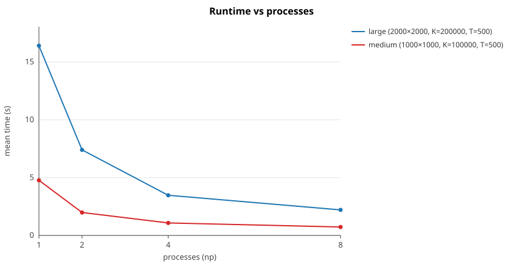
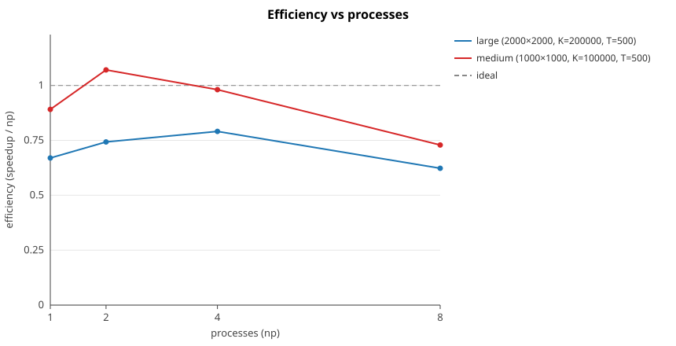

# Bouncing Balls (MPI)


A distributed simulation of balls bouncing on a wrap-around grid, parallelized with MPI.
Balls move one cell per step on an `N × M` toroidal grid; when several land on the same
cell they turn according to a simple collision rule. The interesting part isn't the rules,
it's making the collision resolution scale across processes without every process needing
to see every ball.

There's a single-threaded reference implementation and an MPI version. The MPI version
reaches roughly **5-6x on 8 cores** and reproduces the sequential result exactly.

## The problem

Input is a grid size, a list of balls (position + direction `U/D/L/R`), and a step count `T`.
Each step every ball moves one cell (the grid wraps), then each ball's new direction depends
only on **how many balls share its cell**:

| balls on a cell | result |
| --- | --- |
| 1 or 3 | unchanged |
| 2 | turn 90° right |
| 4 | reverse |

After `T` steps the final position and direction of every ball is printed, in input order.

## How it's parallelized

The key observation is that a collision depends *only* on the balls sharing a single cell,
never on anything elsewhere on the grid. So instead of splitting the **balls** across processes
(which would force an all-to-all every step to rebuild global cell counts), I split the **grid**:
each process owns a contiguous band of rows or columns and every cell belongs to exactly one
process. Collision resolution then becomes entirely local.

The only communication left is balls crossing a band boundary. Since a ball moves at most one
cell per step, it can only ever cross into an immediately neighbouring band, so migration is a
cheap nearest-neighbour exchange on a ring (the grid wraps, so the first and last bands are
neighbours too). Each step is: move locally, exchange boundary-crossers with the two neighbours
via `MPI_Sendrecv`, count occupants, resolve directions.

A few implementation details worth calling out:

- **Split along the larger dimension** so bands stay thin and there are more of them to hand out.
- **Custom `MPI_Datatype`** for the `Ball` struct, reused for scatter, gather and the per-step exchange.
- **Sub-communicator** (`MPI_Comm_split`) caps the active ranks at the grid dimension, so launching
  more processes than there are rows/columns cleanly idles the extras instead of deadlocking.
- **Balls carry their original index**, so the gathered output can be reassembled in input order.

The full reasoning, including the approaches I rejected, is in [docs/parallel_design.md](docs/parallel_design.md).

## Results

Benchmarked on an 8-core / 16-thread Ryzen 7 7840U, timing the algorithm region only
(distribute, simulate, gather), median of several runs. Speedup is against the sequential
implementation.

**large**: `2000×2000`, 200k balls, 500 steps (sequential: 11.0s)

| processes | 1 | 2 | 4 | 8 |
| --- | --- | --- | --- | --- |
| runtime | 16.41s | 7.40s | 3.47s | 2.21s |
| speedup | 0.67× | 1.49× | 3.17× | 4.98× |
| efficiency | 67% | 74% | 79% | 62% |



Scaling is close to linear up to 4 processes and then flattens. Two things drive that:
the smaller cases show **super-linear** speedup at low process counts (each process's working
set shrinks enough to fit in cache), while at 8 processes the fixed per-step cost of a
nearest-neighbour exchange plus a barrier starts to outweigh the shrinking compute per
process. Add the serial parts that don't parallelize (reading input, partitioning on the root,
the final gather+sort) and you get the usual Amdahl ceiling, which on a single machine lands
around the physical core count.





Runtime drops steeply then levels off; efficiency peaks around 4 processes (and tips past 100%
on the medium case from the cache effect) before the communication overhead pulls it back down.


Reproduce with `./tools/run_bench.sh && python3 tools/aggregate.py && python3 tools/plot.py`.

## Build and run

Needs an MPI toolchain (`mpic++`) and a C++17 compiler.

```bash
# build
mpic++ -std=c++17 -O2 src/parallel.cpp   -o build/parallel
g++    -std=c++17 -O2 src/sequential.cpp  -o build/sequential

# run on 4 processes
mpirun -np 4 ./build/parallel < tests/cases/sample2.in

# check the parallel output matches the sequential reference (np = 1,2,4,8,12)
./tests/run_tests.sh

# benchmark + aggregate + plot
./tools/run_bench.sh && python3 tools/aggregate.py && python3 tools/plot.py
```

Each binary prints its timing to `stderr` (`TIME <seconds>`) and results to `stdout`, so the
harness can compare results and read timings independently.

## Layout

```
.
├── src/
│   ├── sequential.cpp      single-threaded reference
│   └── parallel.cpp        MPI implementation
├── docs/
│   ├── sequential_design.md
│   └── parallel_design.md
├── tests/
│   ├── run_tests.sh        correctness: parallel vs sequential
│   └── cases/              sample inputs
├── tools/
│   ├── gen_input.cpp       deterministic input generator
│   ├── run_bench.sh        benchmark runner
│   ├── aggregate.py        stats (speedup, efficiency)
│   └── plot.py             SVG plots
└── results/                benchmark CSVs and generated plots
```

## Limitations

- **Load balance follows the balls.** Equal-sized bands assume a reasonably even spread; if most
  balls pile into a few bands those processes become the bottleneck.
- **One-dimensional decomposition.** A 2-D block split would reduce the boundary-to-area ratio and
  scale further on very large grids, at the cost of more neighbours and bookkeeping.
- **Contiguous ownership** can't rescue a pathological "all balls on one line" input. Hash-based
  cell ownership would, but only by trading the cheap nearest-neighbour exchange for all-to-all.
